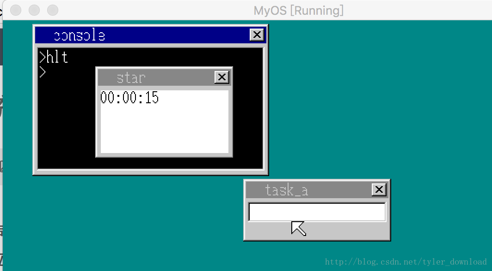
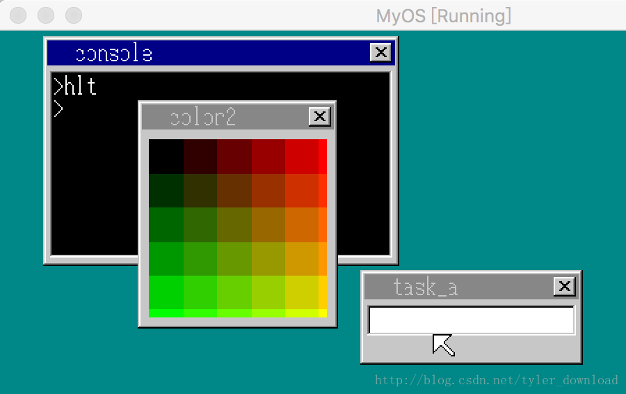

## 增加定时器API与增强系统色彩显示


有关窗口操作的相关功能基本已经完成了，但是要在窗口上开发出有趣的动态功能，我们尚缺关键一环，那就是定时器功能，所有的动态形式都依赖于在不同的时间点内发生不同的状态变化来形成，所以没有定时器API,应用程序开发上就无法实现丰富的动态功能。

本节我们将为内核添加上定时器API,并看看应用程序如何依靠定时器实现动态功能开发。定时器API的基本配置规范如下：

获取定时器句柄：
EDX = 16
EAX = 定时器句柄（由系统内核返回）

设置定时器发送的数据
EDX = 17
EBX = 定时器句柄
EAX = 要发送的数据

设定定时器时间片
EDX = 17
EBX = 定时器句柄
EAX = 定时器时间片

我们现在内核的C语言部分实现定时器API,在write_vga_desktop.c中添加如下代码：

```
int* kernel_api(int edi, int esi, int ebp, int esp,
                int ebx, int edx, int ecx, int eax) {
    struct TASK *task = task_now();
    struct SHEET *sht;
    int  *reg = &eax + 1;
    int i = 0;
    ....
    else if (edx == 16) {
        reg[7] = (int)timer_alloc();
    } else if (edx == 17) {
        timer_init((struct TIMER*)ebx, &task->fifo, eax+256);
    }  else if (edx == 18) {
        timer_settime((struct TIMER*)ebx, eax);
    } else if (edx == 19) {
        timer_free((struct TIMER*)ebx);
    }
   ....
}
```

在内核的实现中，也是像以前一样通过定时器API产生与定时器相关的功能，主要是把定时器句柄返回给应用程序，以便应用程序操作定时器。要注意的是，当edx等于17时，也就是设置定时器发送数值时，我们加上256，由于task->fifo队列会接收两种信息，一种是键盘点击后内核发送过来的键盘扫描码，另一个是应用程序创建定时器后，定时器被触发时发送过来的数据，一旦进程接收到的数据大于256，我们就知道当前数据是定时器数据，而不是键盘数据。

在api_call.asm中添加相关代码：

```
api_alloctimer:
  mov edx, 16
  int 02Dh
  ret

api_inittimer: ;void api_initimer(int timer, int data)
  push ebx
  mov  edx, 17
  mov  ebx, [esp+8]
  mov  eax, [esp+12]
  int  02Dh
  pop  ebx
  ret

api_settimer:  ;void api_settimer(int timer, int time)
  push ebx
  mov  edx, 18
  mov  ebx, [esp + 8]
  mov  eax, [esp + 12]
  int  02Dh
  pop  ebx
  ret

api_freetimer:  ;void api_freetimer(int timer)
  push ebx
  mov  edx, 19
  mov  ebx, [esp + 8]
  int  02Dh
  pop  ebx
  ret
```

这些代码主要是根据API调用规定配置寄存器，构建起应用程序和内核调用间的连接。完成上面代码后，我们看看如何在应用程序中，通过调用定时器API完成一种动态功能的开发。在app.c中添加如下代码：

```
....
int  api_alloctimer(void);
int  api_inittimer(int timer, int data);
int  api_settimer(int timer, int time);
....
char*  intToStr(int v) {
    //把两位数的数字转换成对应字符串
    char s[3] = {'0'};
    s[2] = 0;

    s[1] = v % 10 + '0';
    s[0] = v / 10 + '0';

    return s;
}

void main() {
    char buf[160 * 100];
    char s[9] = {'a', 'p', 'p', 0};
    int win, timer, sec = 0, min = 0, hou = 0;
    win = api_openwin(buf, 150, 100, -1, "star");
    int i = 0;
    timer = api_alloctimer();
    api_inittimer(timer, 128);
    char *p;    
    for(;;) {
        api_boxfilwin(win, 6, 26, 143, 93, 7);
        p = intToStr(hou);
        s[0] = *p;
        s[1] = *(p+1);
        s[2] = ':';
        p = intToStr(min);
        s[3] = *p;
        s[4] = *(p+1);
        s[5] = ':';
        p = intToStr(sec);
        s[6] = *p;
        s[7] = *(p+1);
        api_putstrwin(win, 6, 26, 0, 8, s);

        api_settimer(timer, 100);

        if (api_getkey(1) == 0x1c) {
            api_freetimer(timer);
            break;
        }

        sec++;
        if (sec == 60) {
            sec = 0;
            min++;
            if (min == 60) {
                min = 0;
                hou++;
            }
        }
    }
    api_refreshwin(win, 8, 28, 136, 156);
    while(api_getkey(1) != 0x1c){}
    api_closewin(win);    
    return;
}

```

应用程序先在开头声明了要调用的定时器API, 函数intToStr的作用是，它会把传给它的最多是两位大小的十进制数转换为对应的字符串。在主函数main里，它先启动一个窗体，然后用三个变量，hou,min,sec分别表示时，分，秒。接着启动一个定时器，定时器的触发时间片是一秒，定时器一旦被触发后，数据会发送给控制台进程的队列，api_getkey就会从内核循环中返回到应用程序中来，此时应用程序判断内核队列的数据是否是键盘回车键的扫描码，如果不是，应用程序就知道，一秒长度的时间片被触发了，于是把sec变量的值加1，如果sec的值超过60，表明时间过去了一分钟，于是表示分钟的变量min加一，如果它超过了60，表示时间过去了一个小时，于是hou变量加1.

程序使用intToStr,把用于表示时分秒的三个变量转换成对应的字符串，并组合成如下形式：hh:mm:ss, 然后在窗口上显示，这样程序一旦跑起来时，窗体上就会看到一个根据时间不断变化的字符串，于是窗口相当于变成了一个报时的时钟，运行效果如下：


第二个任务是，为系统增加更多更丰富的显示色彩。当前系统总共只用了16种颜色，但是当前系统使用的是256色显示模式，所以还剩240多种颜色可用，接下来我们再次设置调色板，让系统能显示更多颜色，以便后面开发更绚丽的应用程序。

所有颜色都是由红，绿，蓝三原色通过各自不同的亮度组合而成，我们为每种颜色定义6种亮度，于是系统就可以再次显示6 ^ 3 = 216种不同颜色，在write_vga_desktop.c 中，添加如下代码：

```
void init_palette(void) {
 ....
 set_palette(0, 15, table_rgb);
 unsigned char table2[216 * 3];
    int r, g, b;
    for (b = 0; b < 6; b++) {
       for (g = 0; g < 6; g++) {
           for (r = 0; r < 6; r++) {
               table2[(r + g*6 + b *36)*3 + 0] = r * 51;
               table2[(r + g*6 + b *36)*3 + 1] = g * 51;
               table2[(r + g*6 + b *36)*3 + 2] = b * 51;
           }
       }
    }

    set_palette(16, 231, table2);
    return;
}
```

上面函数构造了一个大小为216*3的调色板，里面的每个数值均表示某个三原色的亮度，通过对该调色板的使用，应用程序可以显示更多的色彩。在app.c中添加如下代码：

```
void main() {
    char buf[144 * 164];
    int win = api_openwin(buf, 144, 164, -1, "color2");
    int y, x, r, g, b;
    for (y = 0; y < 128; y++) {
        for (x = 0; x < 128; x++) {
            r = x * 2;
            g = y * 2;
            b = 0;
            buf[(x+8) + (y+28)*144] = 16 + (r/43) + (g/43)*6 + (b/43)*36;            
        }
    }

    api_refreshwin(win, 8, 28, 136, 156);
    while(api_getkey(1) != 0x1c){}
    api_closewin(win);    
    return;
}
```

代码先创建一个窗口，接着给窗口图层的每个像素点设置一个三原色组合而成的值，系统在绘制窗口时，会从我们前面设置的调色板中查找颜色，然后显示到屏幕上，上面的代码运行后效果如下：




使用第二个调色板后，系统可显示的颜色就更丰富更细腻了，后面我们会在系统上做一个图片查看器，显示图片时，就需要使用到我们现在添加的调色板。

从下节开始，我们将进入到多控制台系统的开发中。更详细的代码讲解和演示，请参看视频。