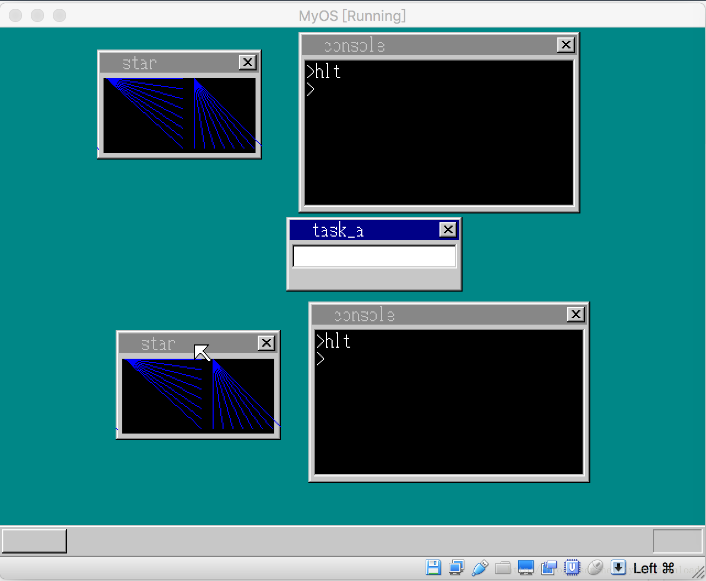

## 同时运行多窗口多任务


在系统有了命令行窗口后，我们可以直接在窗口内输入命令，启动应用程序。当通过命令行加载运行用户开发的程序时，命令行会被‘冷冻’，这是因为被启动的程序与命令行属于同一进程，CPU要把运行的权限交给应用程序，命令行窗口得不到运行的机会，因此看上去像死机一样。

这造成的一个问题是，命令行窗口一次只能加载一个应用程序，然后必须等到程序运行结束后，CPU控制权交还给命令行窗口时，它才有机会启动另一个应用程序。我们可以把命令行窗口的程序启动机制进行修改，使得应用程序运行后，控制台仍然能获取CPU的执行权限，但这么改动难度不小，为了简单起见，我们把系统更改为能同时运行多个命令行窗口，每个窗口能各自加载应用程序，这样我们就能实现多个应用程序同时并行。

我们现在内核的C语言部分做代码更改，在write_vga_desktop.c中，先增加两个变量：

```
static struct TASK *task_cons[2];
```


我们先定义一个全局变量，这个数组将用来存储控制台进程，我们暂时先同时开启两个控制台进程。在CMain主函数中做如下修改：

```
void CMain(void) {
    ....
    struct SHEET *sht_cons[2];
    int k = 0;
    for (k = 0; k < 2; k++) {
        sht_cons[k] = launch_console(k);
    }
    sheet_slide(shtctl, sht_cons[1], 56, 6);
    sheet_slide(shtctl, sht_cons[0], 8, 2);
    sheet_updown(shtctl, sht_cons[1], 1);
    sheet_updown(shtctl, sht_cons[0], 2);
    ....
}
```

这里，我们同时启动两个命令行窗口进程，sht_cons[2]这个变量用来存储命令行窗口的窗口图层，接下来的sheet_slide,和sheet_updown用来调整命令行窗口的位置。

我们接着需要对创建控制台进程的函数launch_console做相应修改:

```
struct SHEET*  launch_console(int i) {
  struct SHEET *sht_cons = sheet_alloc(shtctl);
    unsigned char *buf_cons = (unsigned char *)memman_alloc_4k(memman, 256*165);
    sheet_setbuf(sht_cons, buf_cons, 256, 165, COLOR_INVISIBLE);
    make_window8(shtctl, sht_cons, "console", 0);
    make_textbox8(sht_cons, 8, 28, 240, 128, COL8_000000);

    struct TASK *task_console = task_alloc();

    int addr_code32 = get_code32_addr();
    task_console->tss.ldtr = 0;
    task_console->tss.iomap = 0x40000000;
    task_console->tss.eip =  (int)(console_task - addr_code32);

    task_console->tss.es = 0;
    task_console->tss.cs = 1*8;//6 * 8;
    task_console->tss.ss = 4*8;
    task_console->tss.ds = 3*8;
    task_console->tss.fs = 0;
    task_console->tss.gs = 2*8;
//change here
    task_console->tss.esp = memman_alloc_4k(memman, 64 * 1024) + 64 * 1024 - 12;// 8;
    *((int*)(task_console->tss.esp + 4)) = (int)sht_cons;
    *((int*)(task_console->tss.esp + 8)) = memman_total(memman);


    task_run(task_console,1, 5);


    sheet_slide(shtctl,sht_cons, 32, 4);
    sheet_updown(shtctl, sht_cons, 1);

    //set global task_cons
    task_cons[i] = task_console;

    return sht_cons; 
}
```

该函数相比于原来变动，一是增加了输入参数i，它用来标记当前是第几个控制台进程，在创建进程对象后，在指定它的堆栈指针时，我们从内存分配了64k的内存块：

```
 task_console->tss.esp = memman_alloc_4k(memman, 64 * 1024) + 64 * 1024 - 12;
```

以前的实现没有这么做，因此是一个Bug.创建好进程对象后，把它存入控制台进程数组，接着使用task_run加载进程。由于我们原先设计时只有一个控制台进程，因此很多有关控制台的控制信息都存在一个全局变量g_Console中，现在我们要创建多个控制台，于是使用全局变量就不合适了。因此我们需要把CONSOLE的结构体定义放入到任务对象结构体TASK中，所以我们把struct CONSOLE 的定义转移到global_define.h，然后在mutli_task.h中修改TASK结构体的定义：

```
struct TASK {
    int sel, flags;
    int priority;
    int level;
    struct FIFO8 fifo;
    struct TSS32 tss;
    struct CONSOLE console;
    struct Buffer *pTaskBuffer;
};

#define  MAX_TASKS  10
#define  MAX_TASKS_LV   10
#define  MAX_TASKLEVELS 10

#define  TASK_GDT0  7
#define  SIZE_OF_TASK  256
```

我们除了在TASK结构体中增加了控制台对象console外，还增加了一个Buffer指针pTaskBuffer, 它的作用一会我们会提到。我们的目的是为了创建多个控制台窗口，通过控制台启动多个用户程序，启动用户程序的控制台命令是hlt，实现该命令的函数是cmd_hlt，因此我们也需要对此函数做相应改动：

```
void cmd_hlt() {
io_cli();

    struct Buffer *appBuffer = (struct Buffer*)memman_alloc(memman, 16);
    struct TASK *task = task_now();
    task->pTaskBuffer = appBuffer;

    file_loadfile("abc.exe", appBuffer);
    struct SEGMENT_DESCRIPTOR *gdt =(struct SEGMENT_DESCRIPTOR *)get_addr_gdt();
    int code_seg =  21;
    int mem_seg = 22;
    if (task == task_cons[0]) {
        code_seg = 23;
        mem_seg = 24;
    }


    set_segmdesc(gdt + code_seg, 0xfffff, (int) appBuffer->pBuffer, 0x409a + 0x60);
    //new memory 
    char *q = (char *) memman_alloc_4k(memman, 64*1024);
    appBuffer->pDataSeg = (unsigned char*)q;
    set_segmdesc(gdt + mem_seg, 64 * 1024 - 1,(int) q ,0x4092 + 0x60);
    task->tss.esp0 = 0;
    io_sti();

    start_app(0, code_seg*8,64*1024, mem_seg*8, &(task->tss.esp0));
    io_cli();
    memman_free_4k(memman,(unsigned int) appBuffer->pBuffer, appBuffer->length);
    memman_free_4k(memman, (unsigned int) q, 64 * 1024);
    memman_free(memman,(unsigned int)appBuffer, 16);
    task->pTaskBuffer = 0;
    io_sti();
}
```

在函数里，我们动态创建了Buffer对象，这个对象是用来加载用户开发的程序代码的，当函数调用file_loadfile加载用户程序代码数据后，这些信息会存储在Buffer对象，这个Buffer对象会存储在TASK对象的pTaskBuffer成员变量。

这里需要注意的是，我们要启动两个进程运行同一分用户程序代码，因此代码需要对应不同的段描述符：

```
int code_seg =  21;
    int mem_seg = 22;
    if (task == task_cons[0]) {
        code_seg = 23;
        mem_seg = 24;
    }
```

上面代码片段的作用是，如果当前是第一个控制台进程，那么用户应用程序对应的代码段和数据段描述符分别是23，24，如果是第2个控制台进程，那么应用程序代码对应的代码段和数据段描述符就分别是21，22.

由于我们把全局变量g_Console替换成每个进程task中的console变量，因此代码中所有用到g_Console的地方都要替换成task->console。

完成上面代码改动，加载系统运行后，效果如下：



通过运行效果，我们可以看到，系统运行起来两个控制台窗口，并在每个窗口内执行hlt命令，于是又分别运行了两个相同的用户程序，这一来，整个系统就有5个进程在同时运行。我们虽说现在只有两个控制台窗口，只要稍加修改，系统就能创建任意多个控制台窗口。

从代码上看，实现多进程多窗口似乎不难，但问题在于进行系统性开发，我们没有调试器可用，一旦出现问题，调试非常困难，只能一句一句的排查，由于在指定进程堆栈时，原先存在Bug,也就是原来没有个task->esp 指定一块新内存，致使在开发这个功能是我遇到了莫名其妙的系统奔溃，连续排查了三四天才发现这个错误，大家通过视频开发系统除了能够更加具体高效外，还可以避开我踏入的坑，避免浪费不必要的时间。
