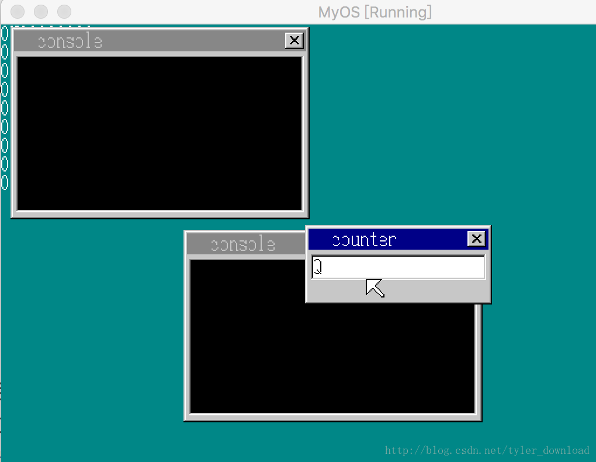
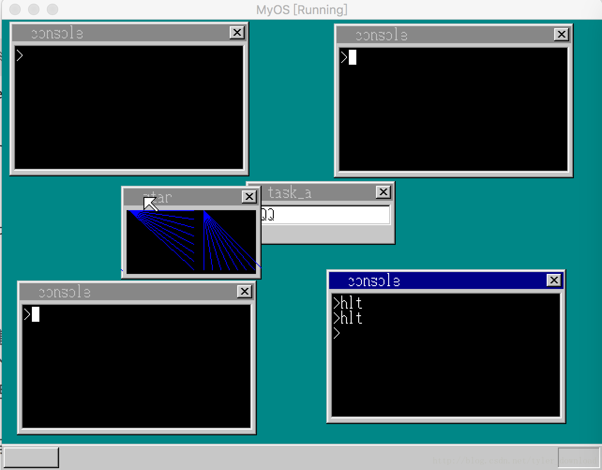
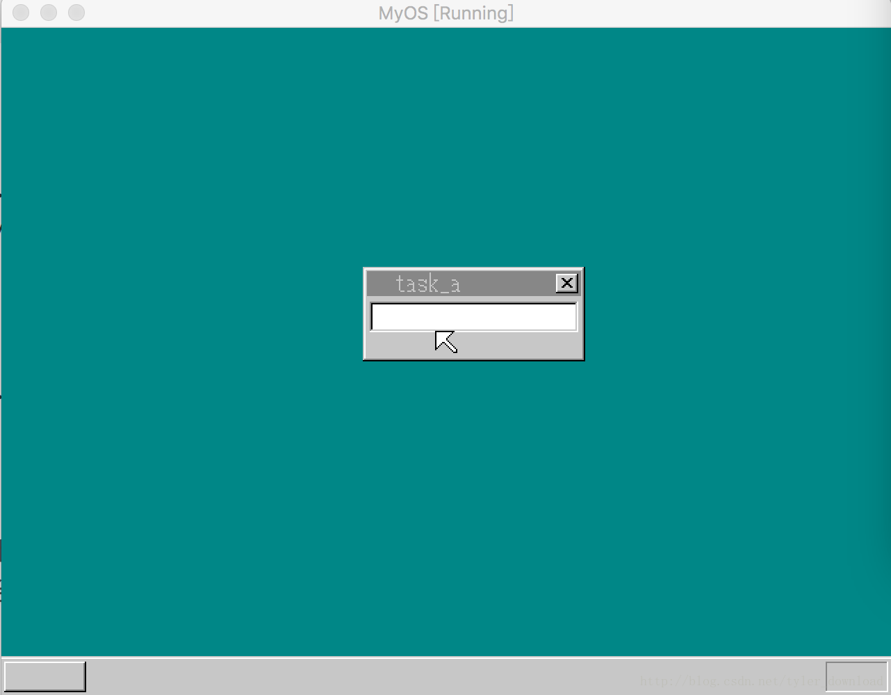

## 启动任意多控制台窗口


当前我们的系统已经能够实现多个控制台窗口，要想生成两个以上的控制台窗口，只需在窗口生成时的for循环处，增加循环次数即可。现在我们系统启动时，一下子会看到两个控制台窗口，这看起来太诡异了。

对于windows来说，我们完全可以在一个控制台窗口中运行命令start cmd.exe来启动一个新的控制台窗口，本节我们将模仿该功能，使得我们能在一个控制台窗口中，通过命令来启动新的控制台窗口。

在完成这个复杂的功能前，我们先实现一个稍微简单点的功能练练手。我们先实现通过按键shift+w 来启动一个新的控制台窗口。先在kernel.asm中增加段选择子的数目：

```
[SECTION .gdt]
 ;                                  段基址          段界限                属性
LABEL_GDT:
    ....

%rep  30
Descriptor 0, 0, 0
%endrep
```

然后在CMain主入口函数中添加如下代码：

```
void CMain(void) {
    ....
    struct SHEET *sht_cons[2];
    int console_count = 0;
    sht_cons[0] = launch_console(0);
    console_count++;
    //sheet_slide(shtctl, sht_cons[1], 156, 176);
    sheet_slide(shtctl, sht_cons[0], 8, 2);
   // sheet_updown(shtctl, sht_cons[1], 1);
    sheet_updown(shtctl, sht_cons[0], 2);
    first_task_cons_selector = task_cons[0]->sel;    

    ....
    for(;;) {
        if (fifo8_status(&keyinfo) + fifo8_status(&mouseinfo) +
           fifo8_status(&timerinfo) == 0) {

           io_sti();
       } else if(fifo8_status(&keyinfo) != 0){
               io_sti();
               data = fifo8_get(&keyinfo);
               ....
               if (key_shift != 0 && data == 0x11) {
                 sht_cons[console_count] =   launch_console(console_count);
                 sheet_slide(shtctl, sht_cons[console_count], 156, 176);
                 sheet_updown(shtctl, sht_cons[console_count], 1);
                 console_count++;
                 }
           }      
    }
    ....
}
```

此外我们在cmd_hlt函数中再做一些修改：

```
void cmd_hlt() {
    ....
    int code_seg = 21 + task->sel - first_task_cons_selector;
    int mem_seg =  30 + task->sel - first_task_cons_selector;
    ....   
}
```

first_task_cons_selector 是第一个控制台进程对应的段选择子，做上面的修改后，在不同的控制台中执行hlt命令启动用户程序时，不同的用户程序的代码段和数据段就会指向不同的段，这样当我们后面实现多控制台功能后，通过不同控制台启动的用户程序就不会发送段冲突。上面代码完成后，加载内核，系统启动后，同时按下shift键和w键，可以看到有一个新的控制台出现在界面上：



接下来，我们要扩展该功能，使得系统能够生成任意多个控制台进程。当控制台进程可以无限多时，我们原来用于存储进程的数组和控制台图层窗口的数组就没有用了，因此代码要做相应改动,在write_vga_desktop.c中，去掉task_cons数组，换成一个执行控制台进程的指针：

```
//static struct TASK *task_cons[2];
int first_task_cons_selector = 0;
static struct TASK *task_main = 0, *current_console_task;
```

我们会生成多个控制台进程，而在任何时候只会有一个控制台进程处于激活状态，这个被激活的进程将会用current_console_task这个指针变量来代替。当我们点击tab键时，要实现主进程和激活控制台进程的切换，而且当有按键信息输入时，按键内容要传递给当前正在处于激活状态的控制台进程，因此相关代码的修改如下：

```
void CMain(void) {
    ....
    struct SHEET* sht_cons;//*sht_cons[2];
    int console_count = 0;
    sht_cons = launch_console(0);
    console_count++;
    //sheet_slide(shtctl, sht_cons[1], 156, 176);
    sheet_slide(shtctl, sht_cons, 8, 2);
   // sheet_updown(shtctl, sht_cons[1], 1);
    sheet_updown(shtctl, sht_cons, 2);
  //  first_task_cons_selector = task_cons[0]->sel; 
  ....
  for(;;) {
  ....
  if (data == 0x0f) {
               int msg = -1;

               if (key_to == 0) {
                   key_to = 1;
                   if (current_console == 1) {
                       current_console = 0;
                   } else {
                       current_console = 1;
                   }
                   make_wtitle8(shtctl, shtMsgBox,"task_a", 0);
                   //change here
                   make_wtitle8(shtctl, current_console_task->sht, "console", 1);
                   set_cursor(shtctl, shtMsgBox, cursor_x, 28 ,COL8_FFFFFF);  
                   msg = PROC_RESUME;
               } else {
                   key_to = 0;
                   make_wtitle8(shtctl, shtMsgBox,  "task_a",1);
                   make_wtitle8(shtctl, current_console_task->sht, "console", 0);
                   msg = PROC_PAUSE;
               }              
              sheet_refresh(shtctl, shtMsgBox, 0, 0, shtMsgBox->bxsize, 21);
              //change here
              sheet_refresh(shtctl, current_console_task->sht, 0, 0, current_console_task->sht->bxsize, 21);
              //send_message(task_a, task_cons[current_console], msg);

           }

          if (key_to == 0) {
               if (transferScanCode(data) != 0 && cursor_x < 144) {
                   set_cursor(shtctl, shtMsgBox, cursor_x,28 ,COL8_FFFFFF);
                   char c = transferScanCode(data);
                   char buf[2] = {c, 0};
                   showString(shtctl,  shtMsgBox, cursor_x, 28, COL8_000000, buf);
                   cursor_x += 8;

                   stop_task_A = 1;
                   set_cursor(shtctl, shtMsgBox, cursor_x, 28, cursor_c);
              } 
           } else if (isSpecialKey(data) == 0)  {
                 //change here
                 fifo8_put(&(current_console_task->fifo), data);

                 if (fifo8_status(&keyinfo) == 0) {             
                     task_sleep(task_a);
                 }
           }


       }
  ....
  }
}
```

我们修改主入口处代码，让系统启动时只创建一个控制台进程，同时当用户按下tab键时，让主进程与当前正处于激活状态的控制台窗口进行切换，并且当用户点击键盘时，键盘信息会被主进程先拿到，然后主进程再把按键消息通过指针current_console_task，传递给当前活跃的控制台进程。

现在问题是，当如果系统上有多个控制台进程时，我们如何决定哪一个是激活的呢，由于控制台窗口可能会有多个，因此我们不能像以前一样根据tab按键来固定的切换不同进程，这次我们修改为，用户用鼠标点击哪个控制台窗口，那么它就转换为激活的控制台进程，控制鼠标动作的函数是show_mouse_info,因此我们要对它的代码加以修改：

```
void  show_mouse_info(struct SHTCTL *shtctl, struct SHEET *sht_back,struct SHEET *sht_mouse) {
    ....
    if (0 <= x && x < sht->bxsize && 0 <= y && y < sht->bysize) {
                        if (sht->buf[y * sht->bxsize + x] != sht->col_inv) {
         //change here
         make_wtitle8(shtctl, current_console_task->sht, "console", 0);
                           sheet_refresh(shtctl,current_console_task->sht, 0, 0, sht->bxsize, sht->bysize);
        current_console_task = sht->task;
        make_wtitle8(shtctl, current_console_task->sht, "console", 1);
        sheet_refresh(shtctl, sht, 0, 0, sht->bxsize, sht->bysize);
    }
    ....
 }
```

当鼠标挪动并点击时，上面的代码会被调用。代码先查询当前鼠标落入哪个窗口中，它先把上一个几乎窗口的标题栏由蓝色转换为灰色，接着把当前鼠标点击的窗口标题栏设置成蓝色，并把current_console_task指针指向当前图层所对应的进程对象。要完成上面的代码，我们需要修改一下TASK和SHEET这两个结构体的设置，一是在TASK结构体中增加一个图层对象，二是在SHEET结构体中增加一个TASK对象，打开multi_task.h和win_sheet.h做如下修改：

```
struct TASK {
    int sel, flags;
    int priority;
    int level;
    struct FIFO8 fifo;
    struct TSS32 tss;
    struct CONSOLE console;
    struct Buffer *pTaskBuffer;
    //change here
    struct SHEET *sht;
};

struct SHEET {
    unsigned char *buf;
    int bxsize, bysize, vx0, vy0, col_inv, height, flags;
    struct TASK *task;
};
```

我们在启动控制台进程时，也要做相应修改，当内核创建一个控制台进程时，它会调用launch_console函数，这个函数执行时，不但要像原来一样启动一个新的控制台进程，还需要把current_console_task指向它，并且把原来的活跃进程设置成非激活状态，代码修改如下：

```
struct SHEET*  launch_console(int i) {
   ....
   //change here
    if (i > 0) {
        make_window8(shtctl, sht_cons, "console", 1);
    } else {
        make_window8(shtctl, sht_cons, "console", 0);
    }

   //change here
    task_console->sht = sht_cons;
    sht_cons->task = task_console;
    //inactive last console window
    if (current_console_task != 0) {
        make_wtitle8(shtctl, current_console_task->sht, "console", 0);
        sheet_refresh(shtctl, current_console_task->sht, 0, 0, current_console_task->sht->bxsize, current_console_task->sht->bysize);
    }
    current_console_task = task_console;

   ....
   // task_cons[i] = task_console;
   ....
}
```

如果创建新的控制台进程时，current_console_task不为空，那表明当前进程并非第一个，因此它会把原来激活的进程设置成非激活状态，并把当前新建进程设置成激活状态。

由于当前控制台进程变多，在控制台中启动用户进程时，需要做相应修改：

```
void cmd_hlt() {
....
//change here select is multiply of 8, divided by 8 get the original value
    int code_seg = 21 + (task->sel - first_task_cons_selector) / 8;
    int mem_seg =  30 + (task->sel - first_task_cons_selector) / 8;//22;
 .... 
}
```

启动用户进程时，需要为其分配代码段和内存段描述符，不同控制台启动的用户进程，必须对应不同的描述符，我们用当前进程的段描述符减去第一个进程的段描述符，然后分别加上21和30后得到的结果作为代码段描述符和内存段描述符的下标。其中除以8是因为，我们在指定描述符下标时，需要左移3位，也就相当于乘以8，因此求差值时要除以8，这样才能得到当前进程与第一个控制台进程间的间隔。

上面代码完成后，加载内核，运行效果如下：



系统每次通过shift+w创建一个新控制台进程时，新窗口会自动变为激活状态，你用鼠标点击其中某个控制台窗口后，被点击的控制台会自动转换成激活态。虽然我们现在控制台进程的数量可以无限制增长，但我们在multi_task.h中定义了进程的最大数量：

```
#define  MAX_TASKS  10
```

也就是内核当前支持的进程数量最大是10个。

当控制台窗口可以一次生成多个后，如何把他们关闭就变得很有必要。接下来我们实现把控制台窗口关闭的功能，现在global_define.h中修改一下CONSOLE结构体的定义：


```
struct CONSOLE {
    struct SHEET *sht;
    int cur_x, cur_y, cur_c;
    char s[2];
    struct TIMER *timer;
    //change here
    char *cmdline;
};
```

增加cmdline指针的目的是，在窗口关闭后能把它对应的内存给释放掉。接着我们增加几个关于结构体关闭及相关内存释放的功能：

```
//change here add console closing function
void close_constask(struct TASK *task) {
    task_sleep(task);
   //problem
    memman_free_4k(memman, task->cons_stack,  64 * 1024);
    memman_free(memman, (int)task->fifo.buf, 128);
    memman_free(memman, (int)task->console.cmdline, 30);
    task->flags = 0;
    current_console_task = 0;
}

void close_console(struct SHEET *sht) {
    struct TASK *task = sht->task;
    timer_free(task->console.timer);

    memman_free_4k(memman, (int)sht->buf, 256 * 165);
    sheet_free(shtctl, sht);
    close_constask(task);
}

void cmd_exit(struct TASK *cons_task) {
    io_cli();
    //send msg to keyboad queue of main process

    fifo8_put(&keyinfo, 255);
    io_sti();
}
```

我们要实现的功能之一是，在控制台输入命令”exit”时，控制台能自我关闭，当控制台执行命令exit时，它会调用函数cmd_exit, 在该函数的实现中，它向主进程发送了一个特别的命令255，这个数值告诉主进程把当前激活的控制台进程给关闭掉，于是主进程受到这个消息后，会调用close_console把对应的控制台进程给关闭，之所以要绕个弯，发消息给主进程来关闭激活的控制台进程，是因为在close_constask实现中调用了task_sleep函数，如果由控制台进程来调用close_constask的话，因为它自己把自己给休眠了，那么后面的代码就无法执行了，因此我们对主进程的代码也做相应修改：

```
else if(fifo8_status(&keyinfo) != 0){
 ....
 //when receive data > 768, it should be a console closing message
         if (data == 255) {
             close_console(current_console_task->sht );
             continue;
         } 
 ....
}
```

同时系统支持通过鼠标点击控制台窗口右上角的x按钮把进程关闭，于是在show_mouse_info函数中也要做代码修改：

```
void  show_mouse_info(struct SHTCTL *shtctl, struct SHEET *sht_back,struct SHEET *sht_mouse) {
   ....
   if (sht->bxsize - 21 <= x && x < sht->bxsize - 5 && 5 <= y && y < 19 && sht->task != 0) {
                                    //change here
                                   /*
                                    io_cli();
                                    sheet_free(shtctl, sht);
                                    int addr_code32 = get_code32_addr();
                                    sht->task->tss.eip = (int)kill_process - addr_code32;
                                    io_sti();
                                  */
                                  cmd_exit(sht->task);
                            }
                            break;
   ....
}
```

接着修改控制台进程的主函数，让他能执行exit命令，这个修改比较简单：

```
void console_task(struct SHEET *sheet, int memtotal) {
    ....
    //change here
                else if ( strcmp(cmdline, "exit") == 1) {
                  cmd_exit(task);
                }
   ....
}
```

完成上面代码后，我们可以通过命令或点击控制台右上角x按钮的方式把打开的控制台进程全部关闭:

