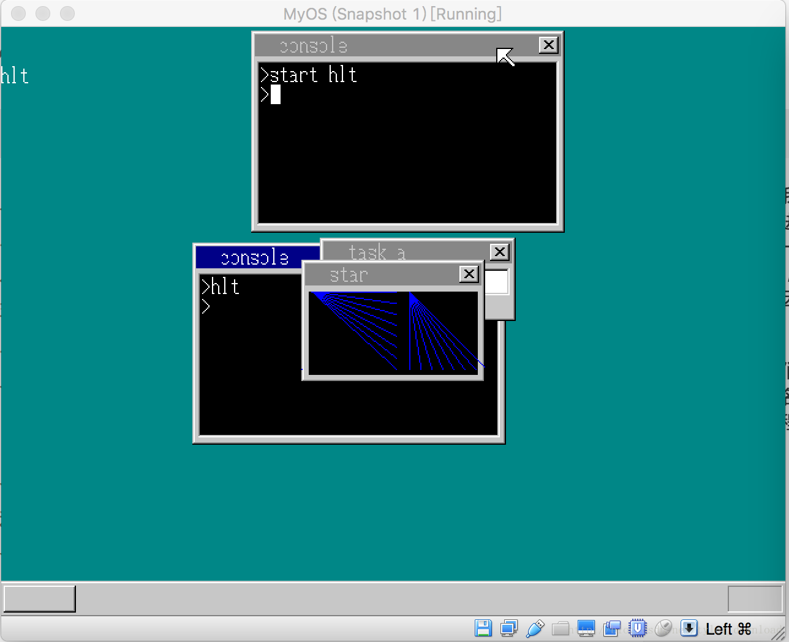
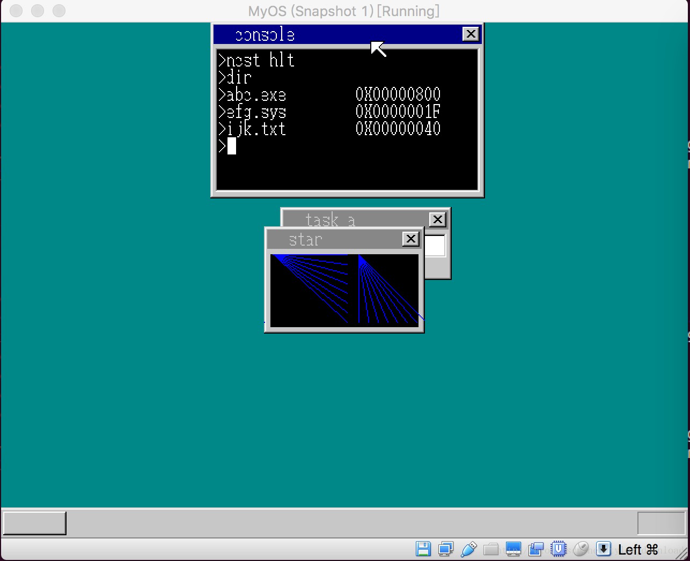

## 不锁死控制台的加载用户进程

当前，我们实现的系统内核支持用户从控制台上输入命令后就能加载执行相应的程序。当我们启动用户进程时，如果进程是含有图形界面的程序，那么控制器会从控制台转移到用户进程，这时产生的一个副作用是，控制台的光标停止闪烁，即使点击键盘，键盘的按键信息也不会在控制台上出现，也就是说因为CPU的执行控制器转移到了用户进程的代码，控制台自己的代码无法得到执行，因而被锁死了。专业的操作系统不会出现这样的窘境，因此本节我们要处理的就是这种情况。

首先我们将开放一个命令叫start, 就像windows一样，在控制台中输入该命令，后面跟着要启动的程序名称，那么控制台就会启动相应程序，程序启动后，控制台还能继续接收命令，也就是控制台进程不应启动新进程而被锁死，完成start命令后，效果如下：




从上图你或许能看出一些‘猫腻’，start 命令的本质是启动一个新的控制台进程，然后把start 后面的字符传给新的控制台，然后再把‘回车’信息传给控制台，这就好像用户在新的控制台中输入相应命令启动进程一样，虽然启动新进程时，还附带了一个我们并不想要的控制台窗口，在后续改进中我们会处理这个问题，再此，我们先看看，start命令的功能是如何实现的。

首先在内核的C语言部分(write_vga_desktop.c)，我们添加一个实现start命令的函数:

```
void cmd_start(char *scanCodeBuf) {
    struct SHEET *sht_cons = launch_console(console_count);

    sheet_slide(shtctl, sht_cons, 156, 176);
    sheet_updown(shtctl, sht_cons, 1);
    console_count++;
    struct TASK *task = sht_cons->task;
    task->fifo.task = 0;
    int i = 6;
    while (scanCodeBuf[i] != 0) {
        fifo8_put(&task->fifo, scanCodeBuf[i]);
        i++;
    }
    task->fifo.task = task;
    fifo8_put(&task->fifo, KEY_RETURN);
}

....
void console_task(struct SHEET *sheet, int memtotal) {
    ....
    char scanCodeBuf[32];
    ....
    //change here
    else if (strcmp(cmdline, "start") == 1) {
       cmd_start(scanCodeBuf);   
    }
    ....
    else {
             char c = transferScanCode(i);

             if (task->console.cur_x < 240 && c!=0 ) {
                 cmdline[task->console.cur_x / 8 - 2] = c;
                 cmdline[task->console.cur_x / 8 - 1] = 0;
                //change here
                 scanCodeBuf[task->console.cur_x / 8 - 2] = i;
                 cons_putchar(c, 1);
            }
    ....
}

struct SHEET*  launch_console(int i) {
....
//change here
    char *fifobuf = (char *)memman_alloc(memman, 128);
    fifo8_init(&task_console->fifo, 128, fifobuf, task_console);

....
}
```

在launch_console函数中，我们添加了初始化控制台进程用来接收消息的队列，这个动作本例是在console_task函数里完成的，我们现在把它移到launch_console函数中完成。在console_task函数，也就是控制台进程的主函数中，我们多定义一个缓冲区叫scanCodeBuf, 它的作用是用来接收用户输入控制台字符所对应的键盘扫描码。当用户在控制台输入”start”命令时，控制台就会调用cmd_start函数来执行相应操作。

在cmd_start函数中，代码先通过调用launch_console启动控制台进程，并配置好控制台的窗口界面，接下来有一些代码逻辑需要强调一下：

```
struct TASK *task = sht_cons->task;
    task->fifo.task = 0;
    int i = 6;
    while (scanCodeBuf[i] != 0) {
        fifo8_put(&task->fifo, scanCodeBuf[i]);
        i++;
    }
    task->fifo.task = task;
    fifo8_put(&task->fifo, KEY_RETURN);
```

首先代码先从控制台的窗口图层对象获得控制台的进程对象，task->fifo对应的就是控制台进程用来接收消息的队列，其中fifo.task对应的是拥有这个队列的进程对象，代码先通过task->fifo.task = 0 将队列包含的进程对象设置为0，这是因为代码接下来要使用fifo8_put把start 命令后面字符创中每个字符对应的键盘扫描码输入到该队列中，但是fifo8_put有个副作用，就是当队列受到信息输入时，如果该队列包含的进程对象不为空，那么它一收到信息就会激活队列所包含的进程对象，打开global_define.c就可以看到相应实现：

```
int fifo8_put(struct FIFO8 *fifo, unsigned char data) {
    if (fifo == 0) {
        return -1;
    }    

    if (fifo->free ==0) {
        fifo->flags |= FLAGS_OVERRUN;
        return -2;
    }

    fifo->buf[fifo->p] = data;
    fifo->p++;
    if (fifo->p == fifo->size) {
        fifo->p = 0;
    }

    fifo->free--;

    if (fifo->task != 0) {
        if (fifo->task->flags != 2) {
            task_run(fifo->task, -1, 0);
            return 1;
        }
    }

    return 0;
}

```

如果cmd_start在把信息输入到新控制台进程的队列前，不把该队列的进程对象设置为0的话，那么fifo8_put只要调用一次，新的控制台进程就会被激活，CPU的控制权就会转移到新控制台进程里，那么cmd_start的代码就不能得到完全的执行，因此就会出错.

所以它先把队列包含的进程对象设置为0，然后把start命令后面字符串每个字符对应的扫描码传入新进程的消息队列，然后再从新恢复队列指向的进程对象，最后把一个回车符的扫描码传入队列，这样新控制台的进程就会被激活，同时新控制台进程运行时，就会发现消息队列里面有信息，它就把消息队列中的信息拿出来，转换为字符，于是新控制台进程一创建就在窗口中包含了老控制台start命令后面的字符串，同时字符串后面还跟着一个回车符，于是新控制台进程以为是用户依靠键盘把命令输进去的，于是它就把start后面的字符串当做命令运行起来，由于我们在老控制台的start 命令后面跟着的字符串是”hlt”,因此新控制台进程启动后，窗口中就立马包含了这个命令，然后新控制台执行该命令，因此就加载了用户进程。最后运行就跟就和上图一样。

接下来我们在此基础上，考虑如何创建一个不带控制台的’start’命令，我们把这个命令称之为’ncst’(no console start)。我们要想办法让用户进程加载时，把附带着的控制台窗口给隐藏掉，亦或让该窗口不再系统上绘制出来。当我们完成’ncst’命令后，运行效果如下：



ncst 后面跟着hlt ，当控制台执行后，用户进程启动，并且不附带一个新的黑色控制台窗口，同时原控制台窗口并未锁死。首先我们在代码中增加一个新变量，show_console_window, 当这个值为0时，创建控制台进程时，不用创建窗口图层对象：

```
int  show_console_window = 0;
....

void cmd_ncst(char *scanCodeBuf) {
    show_console_window = 0;
    launch_console(console_count);
    show_console_window = 1;

    console_count++;
    struct TASK *task = current_console_task;
    task->fifo.task = 0;
    int i = 5;
    while (scanCodeBuf[i] != 0) {
        fifo8_put(&task->fifo, scanCodeBuf[i]);
        i++;
    }
    task->fifo.task = task;
    fifo8_put(&task->fifo, KEY_RETURN);
}
```

函数cmd_ncst 的实现与cmd_start的实现几乎一模一样，只不过在调用launch_console函数前，先把变量show_console_window设置为0，等到调用结束后再把它设置为1，这样launch_Console()函数就必须根据这个变量的值去判断在创建控制台进程时，是否需要创建窗口图层，代码如下：

```
struct SHEET*  launch_console(int i) {
    struct SHEET *sht_cons = 0;
    if (show_console_window != 0) {
        sht_cons = sheet_alloc(shtctl);
        unsigned char *buf_cons = (unsigned char *)memman_alloc_4k(memman, 256*165);
        sheet_setbuf(sht_cons, buf_cons, 256, 165, COLOR_INVISIBLE);

        if (i > 0) {
            make_window8(shtctl, sht_cons, "console", 1);
        } else {
            make_window8(shtctl, sht_cons, "console", 0);
        }
        sheet_refresh(shtctl, sht_cons, 0, 0, sht_cons->bxsize, sht_cons->bysize);

        make_textbox8(sht_cons, 8, 28, 240, 128, COL8_000000);
    }

    struct TASK *task_console = task_alloc();
    task_console->sht = sht_cons;
    //change here 
    if (sht_cons != 0) {
        sht_cons->task = task_console;
    }
    //inactive last console window
    //change here
    if (current_console_task != 0 && sht_cons != 0) {
        make_wtitle8(shtctl, current_console_task->sht, "console", 0);
        sheet_refresh(shtctl, current_console_task->sht, 0, 0, current_console_task->sht->bxsize, current_console_task->sht->bysize);
    }
    ....
}
```

launch_console在执行时，先判断show_console_window变量是否为0，如果是0，那么就不创建窗口图层，接下来一切有关窗口的绘制或显示操作都需要判断一下图层对象是否创建，如果图层对象为0，那么有关窗口的操作就不能执行。这个判断也要代入到task_console，也就是控制台进程函数以及其他相关函数中：

```
void console_task(struct SHEET *sheet, int memtotal) {
   ....
   else if (strcmp(cmdline, "ncst") == 1) {
        cmd_ncst(scanCodeBuf);
   }
   ....
   //change here
            if (cursor_c >= 0 && task->console.sht != 0) {
                 set_cursor(shtctl, task->console.sht, task->console.cur_x, task->console.cur_y, cursor_c);
            }
}
```

我们要在console_task函数里，增加对命令输入’ncst’的相应，同时set_cursor是要在控制台窗口上绘制光标，但此时进程可能没有创建窗口，因此需要判断一下，进程的窗口图层对象是否为0，如果为0，那就不用绘制光标。我们还有几个在图层上进行操作的函数需要做这种判断：

```
void  set_cursor(struct SHTCTL *shtctl, struct SHEET *sheet, int cursor_x, int cursor_y,int cursor_c) {
    //change here
    if (sheet == 0) {
        return;
    }

    boxfill8(sheet->buf, sheet->bxsize, cursor_c, cursor_x,
               cursor_y, cursor_x + 7, cursor_y + 15);
    sheet_refresh(shtctl, sheet, cursor_x, cursor_y, cursor_x+8, cursor_y + 16);

}

....

void showString(struct SHTCTL *shtctl ,struct SHEET *sht, int x, int y, char color, unsigned char *s ) {
    //change here 
    if (shtctl == 0 || sht == 0) {
        return;
    }

    int begin = x;
    int i = 0;
    for (; *s != 0x00; s++) {
       showFont8(sht->buf, sht->bxsize, x, y,color, systemFont+ *s * 16);
       x += 8;
    }

    sheet_refresh(shtctl, sht, begin, y, x , y + 16);
}

void  show_mouse_info(struct SHTCTL *shtctl, struct SHEET *sht_back,struct SHEET *sht_mouse) {
....
if (0 <= x && x < sht->bxsize && 0 <= y && y < sht->bysize) {
                        if (sht->buf[y * sht->bxsize + x] != sht->col_inv) {
                            //change here
                            if (current_console_task->sht != 0) {
                                make_wtitle8(shtctl, current_console_task->sht, "console", 0);
                                sheet_refresh(shtctl,current_console_task->sht, 0, 0, sht->bxsize, sht->bysize);
                            }
                            current_console_task = sht->task;
                            if (current_console_task->sht == 0) {
                                 showString(shtctl, sht_back, 0, 96, COL8_FFFFFF, "user proc");
                            }
                            if (current_console_task->sht != 0) {
                                make_wtitle8(shtctl, current_console_task->sht, "console", 1);
                                sheet_refresh(shtctl, sht, 0, 0, sht->bxsize, sht->bysize);
                            }
     ....
}

void cmd_cls() {
    struct TASK* task = task_now();
    //change here
    if (task->console.sht == 0) {
        return;
    }
    ....
}
int cons_newline(int cursor_y, struct SHEET *sheet) {
    //change here
    if (sheet == 0) {
        return;
    }
    ....
}
```

上面代码修改完成后，编译内核并加载，运行后就可以看到上图所示情况。用ncst命令加载的用户进程不会附带一个控制台窗口，那是因为我们在代码中故意不绘制窗口，用户进程启动后，点击回车就可以把进程给结束掉,但有个问题是，当我们用鼠标点击窗体右上角的X按钮时，无法正常关闭窗口，这个问题我们将留到下一节处理。
