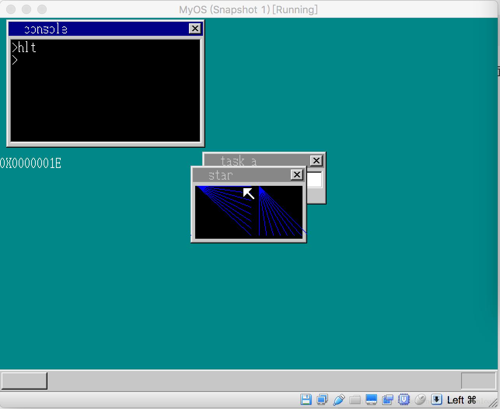
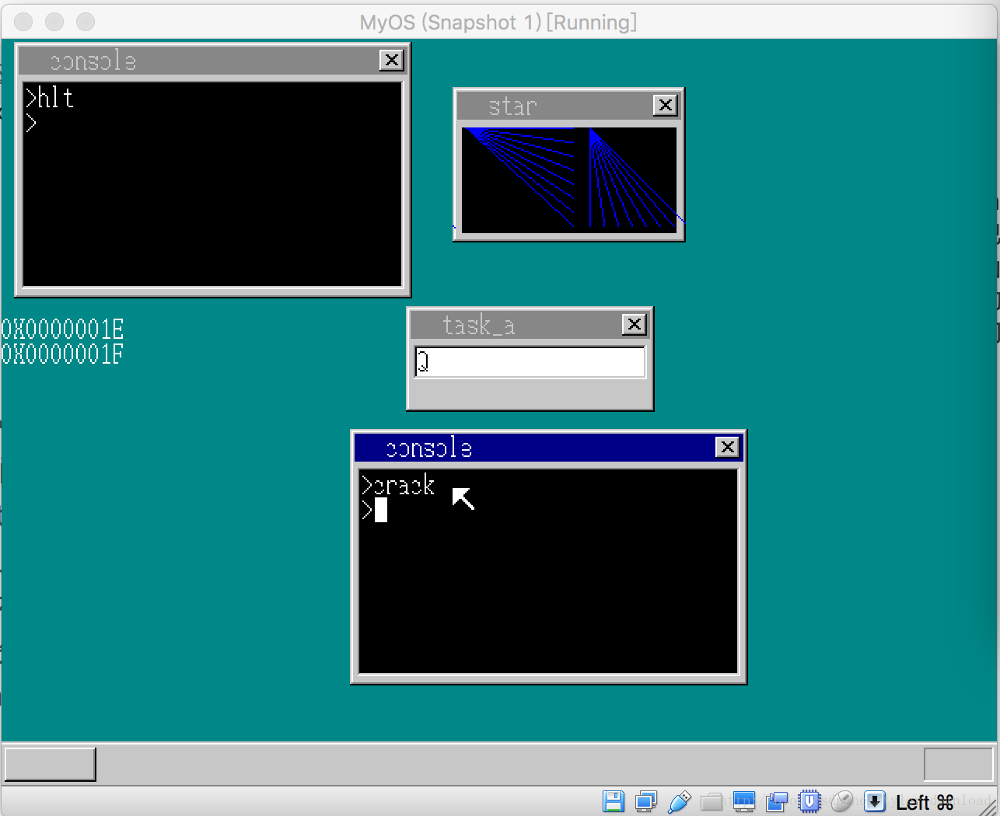
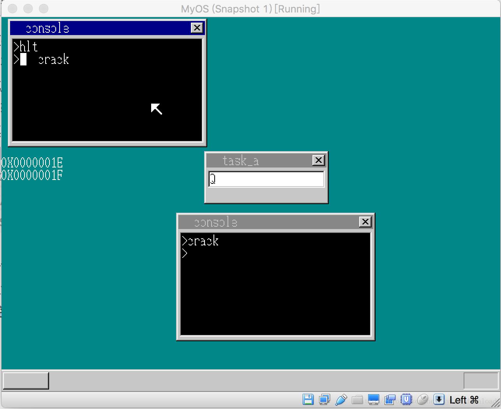

## 一个程序向另一个程序伸出的咸猪手

安全，是一个操作系统必须具备的根本特性。我们的系统发展到现在，安全性能上当然不可能与专业系统同日而语，但该做到的，系统内核都应该努力完善。前几期课程，我们给系统内核增加了中断处理，于是当应用程序妄图执行特权指令，想要染指内核运行时，中断会把程序强行切断，内核从中断中重新获得CPU的执行权限。

虽说恶意用户程序难以攻击内核，但是系统当前还存在一个漏洞，使得恶意程序能取攻击另一个程序，我们看看这个问题到底是怎么实现的。我们先在内核C语言部分做简单修改，把原来的cmd_hlt函数改为cmd_execute_program:

```
nt show_pos = 179;
void cmd_execute_program(char* file) {
    io_cli();

    struct Buffer *appBuffer = (struct Buffer*)memman_alloc(memman, 16);
    struct TASK *task = task_now();
    task->pTaskBuffer = appBuffer;

    file_loadfile(file, appBuffer);
    struct SEGMENT_DESCRIPTOR *gdt =(struct SEGMENT_DESCRIPTOR *)get_addr_gdt();
    //select is multiply of 8, divided by 8 get the original value
    int code_seg = 21 + (task->sel - first_task_cons_selector) / 8;
    //change here
    int mem_seg = 30 + (task->sel - first_task_cons_selector) / 8;//22;
    char *p = intToHexStr(mem_seg);
    showString(shtctl, sht_back, 0, show_pos, COL8_FFFFFF, p); 
    show_pos += 16;

    set_segmdesc(gdt + code_seg, 0xfffff, (int) appBuffer->pBuffer, 0x409a + 0x60);
    //new memory 
    char *q = (char *) memman_alloc_4k(memman, 64*1024);
    appBuffer->pDataSeg = (unsigned char*)q;
    set_segmdesc(gdt + mem_seg, 64 * 1024 - 1,(int) q ,0x4092 + 0x60);
    task->tss.esp0 = 0;
    io_sti();

    start_app(0, code_seg*8,64*1024, mem_seg*8, &(task->tss.esp0));
    io_cli();
    memman_free_4k(memman,(unsigned int) appBuffer->pBuffer, appBuffer->length);
    memman_free_4k(memman, (unsigned int) q, 64 * 1024);
    memman_free(memman,(unsigned int)appBuffer, 16);
    task->pTaskBuffer = 0;
    io_sti();

}

void console_task(struct SHEET *sheet, int memtotal) {
    ....
    for(;;) { 
    ....
    else if (i == KEY_RETURN) {
    ....
    } else if (strcmp(cmdline, "hlt") == 1) {
        //change here
        cmd_execute_program("abc.exe");
    }
    ....
    }
    ...
}
```

原来的cmd_hlt函数默认加载并执行软盘中的abc.exe程序，现在我们把cmd_hlt改名为cmd_execute_program，并且函数需要传入一个字符串，用于表明要加载执行的程序名字。在该函数的代码实现中，我们使用showString函数把被加载执行的用户进程数据段所对应的全局描述符号给显示到桌面上，上面代码执行后情况如下：



我们看到，在控制台中执行hlt命令后，内核加载了用户进程，同时在控制台下方输出了一个字符串，也就是0x1E,这个数值对应的就是当前运行用户进程其数据段对应的全局描述符号。一旦有这个信息之后，另一个进程就可以有机可乘了。

接着我们在本地目录创建一个新文件叫crack.c,其内容如下：

```
void main() {
    char *p = (char*)0x123;
    p[0] = 'c';
    p[1] = 'r';
    p[2] = 'a';
    p[3] = 'c';
    p[4] = 'k';
    p[5] = 0;
}
```

它的目的简单，就是针对内存地址0x123处写入字符串”crack”.接着我们修改一下makefile，使得内核编译时，能把crack.c编译成二进制文件：

```
CFLAGS=-fno-stack-protector
ckernel : ckernel_u.asm app_u.asm crack_u.asm 
    cp ckernel_u.asm win_sheet.h win_sheet.c mem_util.h mem_util.c write_vga_desktop.c timer.c timer.h global_define.h global_define.c multi_task.c multi_task.h app_u.asm app.c crack_u.asm crack.c  makefile '/media/psf/Home/Documents/操作系统/文档/19/OS-kernel-win-sheet/'
ckernel_u.asm : ckernel.o

....

crack_u.asm : crack.o
    ./objconv -fnasm crack.o crack_u.asm
crack.o : crack.c
    gcc -m32 -fno-stack-protector -fno-asynchronous-unwind-tables -s -c -o crack.o crack.c
```

然后我们在本地目录下，把api_call.asm拷贝一份，并命名为crack_call.asm,后者内容与前者完全相同，只不过稍微有那么一点点改变，例如：

```
BITS 32
mov AX, 30 * 8
mov DS, ax
call main

mov  edx, 4  ;返回内核
int  02Dh

....
```

这里需要注意，语句：

```
mov AX, 30 * 8
mov DS, ax
```

其中30对应的就是前面显示的0x1E，这两句汇编的作用是，把程序crack的数据段设置成下标为30的全局描述符所指向的内存段一致。这就意味着crack进程所使用的数据段就跟hlt启动的进程所使用的数据段一致了！于是在crack.c中，它对内存地址为0x123的地方写入字符串”crack”,那就意味着对hlt加载用户进程的内存空间写入对应字符串！

完成上面代码后，我们在java项目中，增加代码，一是用来编译crack进程，而是把crack代码写入虚拟磁盘。在OperatingSystem.java中，将代码做如下添加：

```
 public void makeFllopy()   {
    writeFileToFloppy("kernel.bat", false, 1, 1);
    ....
    header = new FileHeader();
    header.setFileName("crack");
    header.setFileExt("exe");
    file = new File("crack.bat");
    in = null;
    try {
        in = new FileInputStream(file);
        long len = file.length();

        int count = 0;
        while (count < file.length()) {
            bbuf[count] = (byte) in.read();
            count++;
        }

        in.close();
    }catch(IOException e) {
        e.printStackTrace();
        return;
    }
    header.setFileContent(bbuf);
    fileSys.addHeader(header);
    ....
}

public static void main(String[] args) {
        CKernelAsmPrecessor kernelPrecessor = new CKernelAsmPrecessor();
        kernelPrecessor.process();
        kernelPrecessor.createKernelBinary();

        CKernelAsmPrecessor appPrecessor = new CKernelAsmPrecessor("hlt.bat", "app_u.asm", "app.asm", "api_call.asm");
        appPrecessor.process();
        appPrecessor.createKernelBinary();

        CKernelAsmPrecessor crackPrecessor = new CKernelAsmPrecessor("crack.bat", "crack_u.asm", "crack.asm", "crack_call.asm");
        crackPrecessor.process();
        crackPrecessor.createKernelBinary();


        OperatingSystem op = new OperatingSystem("boot.bat");
        op.makeFllopy();
    }
```

在main函数中，我们把crack.c及其附属汇编文件结合在一起，编译成二进制文件crack.bat，在makeFllopy中，我们把编译后的crack.bat二进制数据读入，并把它写入到虚拟磁盘中，当系统运行起来后，可以把crack.bat二进制内容作为进程加载执行。

完成上面代码后，回到内核的C语言部分，也就是write_vga_desktop.c做一些修改，在kernel_api函数中，修改如下：

```
int* kernel_api(int edi, int esi, int ebp, int esp,
                int ebx, int edx, int ecx, int eax) {
    ....
    else if (edx == 14) {
        sheet_free(shtctl, (struct SHEET*)ebx);
        //change here
        cons_putstr((char*)(task->pTaskBuffer->pDataSeg + 0x123));
    }
    ....
}

void console_task(struct SHEET *sheet, int memtotal) {
    ....
    for(;;) {
    ....
    else if (i == KEY_RETURN) {
    ....
    else if (strcmp(cmdline, "crack") == 1) {
          cmd_execute_program("crack.exe");
    }
    ....
    }
    ....
}
```

在kernel_api中，if(edx == 14)对应的api调用是api_closewin，也就是当用户进程关闭窗口时，我们把进程数据偏移0x123处的数据当做字符串打印到控制台窗口上，在console_task控制台进程主函数中，我们增加了对命令crack的响应，当用户在控制台上输入命令”crack”时，将crack代码加载到内核中运行。上面代码完成后，编译内核，然后用虚拟机将内核加载，系统启动后，我们现在一个控制台中输入hlt，先启动用户进程。然后点击”shift + w”,启动另一个控制台窗口，在其中输入crack，运行crack程序：



接着把点击tab键，把焦点恢复到窗口task_a，然后用鼠标点击运行hlt命令的窗口，把输入焦点切换到该控制台，然后再次点击tab键，把执行权限提交给运行hlt命令的控制台，此时点击回车，介绍用户进程启动的窗口，结果情况如下



此时我们可以看到，运行hlt命令，执行用户进程的控制台窗口居然输出了字符串”crack”,而这个字符串正是crack.c在执行时，写入地址0x123的字符串。这就意味着一个恶意进程成功修改了另一个进程的内存数据，也相当于一个流氓程序把一只咸猪手伸到其他用户进程的裙底，蹂躏一番后留下了猥琐的证据。

那么如何防范恶意进程对其他程序的非法入侵呢，这就得使用CPU提供的LDT机制，也就是局部描述符表，该机制的使用，我们将在下一节详细讲解。更详细的讲解和代码演示调试，请参看视频：
