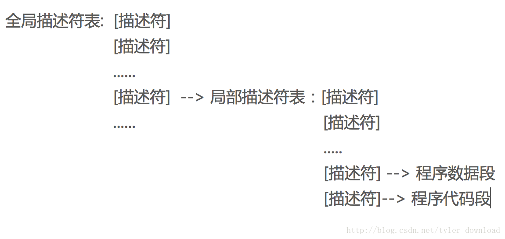
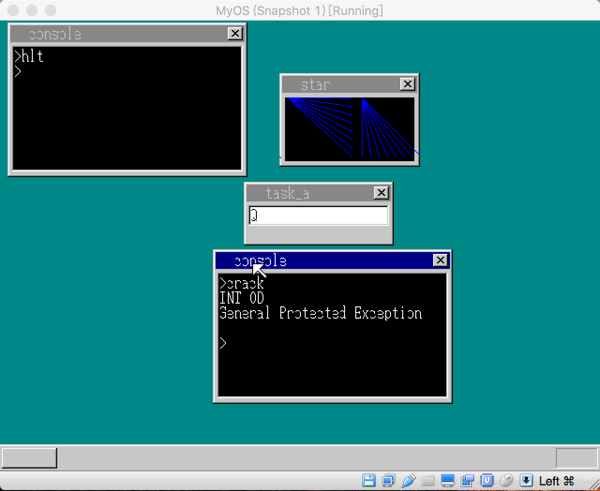

## 使用LDT保护进程数据和代码


上一节，我们开发了一个流氓程序，当他运行起来后，能够把自己的数据写入到另一个进程的数据内存中。之所以产生这样的漏洞，是因为被入侵进程的数据段所对应的全局描述符在全局描述符表中。恶意程序通过在全局描述符表中查找，当找到目标程序的内存描述符后，将对应的描述符加载到自己的ds寄存器里，于是恶意程序访问内存时，就相当于读写目标程序的内存。

要防范此类入侵，最好的办法是让恶意程序无法读取自己内存段对应的描述符，但是如果不把自己的内存描述符放置在全局描述符表中的话，还能放哪里呢？Intel X86架构还给我们提供了另一种选择。除了全局描述符表(GDT)外，X86还提供了另一种数据结构叫局部描述符表(LDT),局部描述符表的结构跟全局描述符表一模一样。不同的是，全局描述符表只能存在一份，而局部描述符表可以是每个进程一份。当进程被内核加载运行时，它可以让CPU加载自己的局部描述符表，然后把自己的数据段描述符和代码段描述符存入局部描述符表。局部描述符表只能由相应的进程访问，其他进程想要访问本进程的局部描述符表时会被CPU拒绝。

全局描述符表和局部描述符表就构成了一个级联层次。CPU先访问全局描述符表，全局描述符表中的一个描述符指向局部描述符表的起始地址，内核调用指令lldt ， 指令的参数是指向局部描述符表起始地址的描述符在全局描述符表中的偏移，指令执行后，局部描述符表就被CPU所加载。当程序被加载时，CPU会从局部描述符表中获得程序的代码段和数据段。由于局部描述符表的访问仅限当前进程，其他进程访问不了，因此其他进程就无法获取到本进程数据段和代码段的相关信息。

全局描述符表和局部描述符表的结构如下：



我们看看如何在代码中使用上局部描述符表。打开multi_task.h文件，我们看看TSS数据结构的定义：

```
struct TSS32 {
    int backlink, esp0, ss0, esp1, ss1, esp2, ss2, cr3;
    int eip, eflags, eax, ecx, edx, ebx, esp, ebp, esi, edi;
    int es, cs, ss, ds, fs, gs;
    int ldtr, iomap;
};
```

注意代码中的ldtr,在上图中，有一个描述符指向了局部描述符表的起始位置，ldtr就是该描述符在全局描述符中的下标。由于局部描述符表是跟各自进程相关的，所以每个进程都可以为自己分配一个局部描述符表，因此在表示进程的TASK数据结构中，我们增加局部描述符表的定义：

```
struct TASK {
    int sel, flags;
    int priority;
    int level;
    struct FIFO8 fifo;
    struct TSS32 tss;
    struct CONSOLE console;
    struct Buffer *pTaskBuffer;
    struct SHEET *sht;
    //change here add stack record
    int cons_stack;
    //change here
    struct SEGMENT_DESCRIPTOR ldt[2]; 
};
```

最末尾的ldt就是进程对应的局部描述符表，显然它只含有两个描述符，目前我们的进程只含有数据段和代码段，因此两个描述符足够了。进入multi_task.c看看如何将附带在进程对象上的局部描述符加载到CPU里。


```
struct TASK  *task_init(struct MEMMAN *memman) {
    int  i;
    struct TASK *task;
    struct SEGMENT_DESCRIPTOR *gdt = (struct SEGMENT_DESCRIPTOR *)get_addr_gdt();
    taskctl = (struct TASKCTL *)memman_alloc_4k(memman, SIZE_OF_TASKCTL);
    for (i = 0; i < MAX_TASKS; i++) {
        taskctl->tasks0[i].flags = 0;
        taskctl->tasks0[i].sel = (TASK_GDT0 + i) * 8;
        //change here
        taskctl->tasks0[i].tss.ldtr = (TASK_GDT0 + MAX_TASKS + i) * 8;
        set_segmdesc(gdt + TASK_GDT0 + i, 103, (int)&taskctl->tasks0[i].tss,
        AR_TSS32);
        //change here
        set_segmdesc(gdt + TASK_GDT0 + MAX_TASKS + i, 15, (int)taskctl->tasks0[i].ldt, AR_LDT);
    }
    ....
}
```

TASK_GDT0 的值是7，在全局描述符表中，前7个描述符有专门用途，从第7个往后就用来指向进程对应的任务门描述符(TSS),当前我们的系统内核最多支持同时运行的进程数是MAX_TASK,因此从第7个描述符往后数MAX_TASK个描述符，全都是用来指向用户进程的任务门描述符。接下来的描述符则用来指向用户进程的局部描述符表，代码中我们设置了tasks[i].tss.ldtr的值，这个值就是上图中，全局描述符表里指向局部描述符表的那个描述符对应的下标。语句：

```
set_segmdesc(gdt + TASK_GDT0 + MAX_TASKS + i, 15, (int)taskctl->tasks0[i].ldt, AR_LDT);
```

它的作用是将局部描述符表的起始地址放置到全局描述符表对应的描述符中，AR_LDT的值是0x0082,用来表示当前描述符是专门指向一个局部描述符表的描述符。在分配任务对象的函数task_alloc中，我们要把一条语句注释掉：

```
struct TASK *task_alloc(void) {
    int i;
    struct TASK *task;
    for (i = 0; i < MAX_TASKS; i++) {
        if (taskctl->tasks0[i].flags == 0) {
        ....
        //task->tss.ldtr = 0;
        }
    }
}
```

由于tss里面的ldtr变量指向的是全局描述符表中用来对应局部描述符表的那个描述符下标，所以此处不再把它初始化为0.接着我们回到write_vga_desktop.c，在函数cmd_execute_program中，做相应修改：

```
void cmd_execute_program(char* file) {
    ....
    //change here
//    set_segmdesc(gdt + code_seg, 0xfffff, (int) appBuffer->pBuffer, 0x409a + 0x60);
    set_segmdesc(task->ldt + 0, 0xfffff, (int) appBuffer->pBuffer, 0x409a + 0x60);
    //new memory 
    char *q = (char *) memman_alloc_4k(memman, 64*1024);
    appBuffer->pDataSeg = (unsigned char*)q;

    //change here
  //  set_segmdesc(gdt + mem_seg, 64 * 1024 - 1,(int) q ,0x4092 + 0x60);
    set_segmdesc(task->ldt + 1, 64*1204 - 1, (int) q, 0x4092 + 0x60);
....
   //change here
//    start_app(0, code_seg*8,64*1024, mem_seg*8, &(task->tss.esp0));
    start_app(0, 0*8+4,64*1024, 1*8+4, &(task->tss.esp0));
    ....
}
```

原来我们在加载用户进程时，会把用户进程的代码段和数据段设置到全局描述符表gdt中，现在我们改变了，我们把它设置到局部描述发表中，局部描述符表对应的正是task->ldt,它只有两个描述符，我们把用户进程的代码段放入到第一个描述符，把用户进程的数据段放入到第二个描述符。在调用start_app把跳转到用户进程的代码时，我们传给该函数的代码段编号为 0*8, 0就是代码段在局部描述符表中的位置，这里要注意的是我们还“+4”，加4告诉CPU,当前的段在局部描述符表中，要到局部描述符表中去查找，后面的参数1*8+4，表示数据段在表中的下标是1，加4也是告诉CPU到局部描述符表中去查找相应的段。

我们总结一下当前进程加载的基本逻辑：

1，每一个控制台进程都对应着一个数据结构叫TSS
2，在全局描述符表中含有一个表项对应着这个TSS数据结构
3，当启动控制台进程时，内核用一个jmp指令，指令的参数就是步骤2中表项对在全局描述符表中的下标
4，CPU执行jmp指令时，把指令后面对应的表项从全局描述符表中拿到，读取表项，找到TSS结构在内存中的地址，接着使用指令ltr把tss结构的信息加载到CPU中
5，CPU根据加载的TSS数据结构信息，把用户进程的代码和数据加载到内存中。同时读取TSS结构中ldtr这个变量的值
6，CPU知道TSS中ldtr变量对应的就是是全局描述符表中的一个表项，这个表项指向的是进程局部描述符表所在的位置
7，CPU根据TSS.ldtr指向的表项，获得局部描述符表的内存地址，执行指令lldt把局部描述符表加载到CPU里。
8，CPU开始执行进程的第一条指令
9，进程运行后，再把自己的代码段和数据段设置到局部描述符表中，就像我们上面cmd_execute_program函数所做的那样。

上面代码完成后，我们再次加载内核，运行crack程序看看是什么结果：


crack程序运行时奔溃掉了。这是因为我们不再把客户进程的数据段设置在全局描述符表中下标为30的描述符中，于是当crack程序妄图加载下标为30的描述符时，CPU发现这个描述符并为被初始化，于是就产生了错误异常，引发的异常会使得CPU的控制权交还给内核，内核在异常处理中会强行中的crack程序，这样crack程序就无法入侵客户进程了。

如果crack进程要想成功入侵客户进程，那么必须获得客户进程的局部描述符表，但该表只能被对应的进程所访问，其他进程是没有权限也没有办法访问的，这样客户进程的代码和数据就能得到完好的保护，恶意进程也无计可施。对代码更详细的讲解和调试演示，请参看视频：
