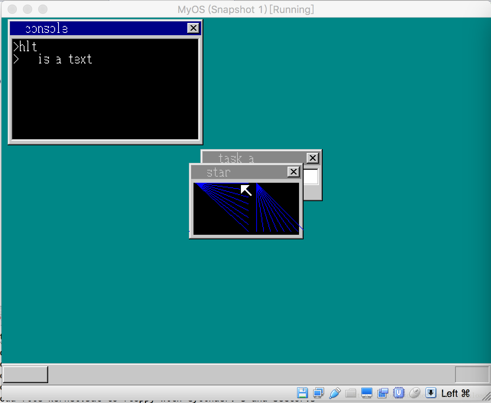

## 创建文件操作API

文件系统是所以操作系统的核心，系统的数据必须以文件的方式存储和组织。我们现在的系统没有硬盘，因此所有信息都存储在磁盘里，在内核加载时，引导扇区程序就会把磁盘上相关数据全都拷贝到内存里，于是所有文件内容在系统启动后，会从磁盘转存到内存中。

在前几节，我们已经建立了简易的文件系统，本节，我们为文件系统增加几个有利于文件读取操作的API.根据常用的文件API,我们提供的接口将支持以下几种操作：
1， 文件打开 api_fopen
2， 文件定位 api_fseek
3， 文件读取 api_fread
4， 文件写入 api_fwrite
5， 文件关闭 api_fclose

打开文件时，需要指定文件名，如果打开成功，api会返回文件句柄，后续操作都必须基于打开的文件句柄。当对文件操作结束后，需要通过句柄关闭文件，以免造成内存泄漏。

文件定位其实是设置文件读取时的起始位置，文件的读取和写入需要指定数据长度和缓冲区地址，根据这些规定，我们着手实现代码，我们先看看有关文件的数据结构设计,在multi_task.h中添加如下代码：

```
struct FILEHANDLE {
    char *buf;
    int size;
    int pos;
};

struct TASK {
    int sel, flags;
    int priority;
    int level;
    struct FIFO8 fifo;
    struct TSS32 tss;
    struct CONSOLE console;
    struct Buffer *pTaskBuffer;
    struct SHEET *sht;
    //change here add stack record
    int cons_stack;
    struct SEGMENT_DESCRIPTOR ldt[2]; 
    // change here
    struct FILEHANDLE *fhandle;
};
```

FILEHANDLE用来表示文件的句柄对象，buf用来指向文件内容在内存中的位置，size用来指定文件大小，pos指定文件开始读取的位置。

在TASK结构体中，我们增加了一个FILEHANDLE类型的指针，它将用来指向一组文件句柄。

在调用API时，相应的寄存器内容规定如下：
打开文件：
edx = 21
ebx = 文件名
eax = 文件句柄，作为API返回值

关闭文件：
edx = 22
eax = 文件句柄

文件定位：
edx = 23
eax = 文件句柄
ecx = 定位模式, 0定位的起点从文件头开始；1定位的起点为当前的访问位置；2定位的起点从文件末尾开始。

获取文件大小：
edx = 24
eax=文件句柄
ecx=文件大小获取模式 0普通文件大小，1当前读取位置从文件开头算起的位置，2当前读取位置从文件末尾算的偏移
eax=文件大小 作为返回值由API返回

文件读取：
edx = 25
eax = 文件句柄
ebx=缓冲区地址
ecx=最大读取字节数
eax=本次读取的字节数 由API返回

我们在进程对象产生时，先把它附带的文件句柄初始化为0，在write_vga_desktop.c中添加如下代码：

```
struct SHEET*  launch_console(int i) {
....
/*
    init file handles for task
    */
    struct FILEHANDLE fhandle[8];
    for (i = 0; i < 8; i++) {
        fhandle[i].buf = 0;
    }
    task_console->fhandle = fhandle;
....
}

....
void cmd_execute_program(char* file) {
....
io_sti();
    start_app(0, 0*8+4,64*1024, 1*8+4, &(task->tss.esp0));
    io_cli();
    //change here
    /*
    close any file handles
    */
    int i = 0;
    for (i = 0; i < 8; i++) {
        if (task->fhandle[i].buf != 0) {
            memman_free_4k(memman, (unsigned int)task->fhandle[i].buf, task->fhandle[i].size);
            task->fhandle[i].buf = 0;
        }
    }
    ....
}
```

当系统启动一个进程时，会调用launch_console创建一个TASK对象，于是我们顺便初始化进程对象包含的文件句柄对象。当子进程调用结束后，也就是从start_app调用返回时，我们立刻把原来分配的句柄对象进行回收。

接着我们在专门实现API调用的函数kernel_api里添加文件操作相关的代码：

```
int* kernel_api(int edi, int esi, int ebp, int esp,
                int ebx, int edx, int ecx, int eax) {
    ....
     /*
    add file handling api
    */
    else if (edx == 21) {
        for (i = 0; i < 8; i++) {
            if (task->fhandle[i].buf == 0) {
                break;
            }
        }
        fh = &task->fhandle[i];
        reg[7] = 0;
        if ( i < 8) {
             struct Buffer buffer;
             buffer.pBuffer = 0;
             char *file_name = (char*)(task->pTaskBuffer->pBuffer + ebx);
             file_loadfile(file_name, &buffer);
             if (buffer.pBuffer != 0) {
                 reg[7] = (int)fh;
                 fh->buf = buffer.pBuffer;
                 fh->size = buffer.length;
                 fh->pos = 0;
             }
        }
    }
    else if (edx == 22) {
        fh = (struct FILEHANDLE *)eax;
        memman_free_4k(memman, (unsigned int)fh->buf, fh->size);
        fh->buf = 0;
    }
    else if (edx == 23) {
        fh = (struct FILEHANDLE *)eax;
        if (ecx == 0) {
            fh->pos = ebx;
        } else if (ecx == 1) {
            fh->pos += ebx;
        } else if (ecx == 2) {
            fh->pos = fh->size + ebx;
        }
        if (fh->pos < 0) {
            fh->pos = 0;
        }
        if (fh->pos > fh->size) {
            fh->pos = fh->size;
        }
    }
    else if (edx == 24) {
        fh = (struct FILEHANDLE*)eax;
        if (ecx == 0) {
            reg[7] = fh->size;
        } else if (ecx == 1) {
            reg[7] = fh->pos;
        } else if (ecx == 2) {
            reg[7] = fh->pos - fh->size;
        }
    }
    else if (edx == 25) {
       fh = (struct FILEHANDLE*)eax;
       for (i = 0; i < ecx; i++) {
           if (fh->pos == fh->size) {
               break;
           }
           *((char*)(task->pTaskBuffer->pDataSeg + ebx + i)) = fh->buf[fh->pos];
           fh->pos++;
       }
       reg[7] = i;
    }
    return 0;
}
```

当edx等于21时，代码先从当前进程对象的文件句柄数组中查找到一个空余的句柄对象，然后根据传入的文件名，使用file_loafile函数将对应文件的内容加载到缓冲区中，如果给定的文件可以查找到的话，文件数据的缓冲区，文件的大小，文件读取的起始文章等信息会存入到文件句柄对象中，并把句柄对象的地址当做返回值，返回给api的调用者。

当edx等于25时，就是把文件内容读取到调用者提供的缓冲区中，edx=23或24时，实现读取文件大小和根据给定形式设置文件的读取定位。

有了内核的代码实现后，我们还需要利用汇编代码实现将客户进程的代码和内核API代码的连接，因此在api_call.asm中添加如下代码：

```
api_fopen:  ;int api_fopen(char *fname)
  push ebx
  mov edx, 21
  mov ebx, [esp + 8]
  int 02Dh
  pop ebx
  ret

api_close:  ;void api_close(int handle)
  mov edx, 22
  mov eax, [esp+4]
  int 02Dh

api_fseek:  ;void api_fseek(int fhandle, int offset, int mode)
  push ebx
  mov edx, 23
  mov eax, [esp+8] ;fhandle
  mov ecx, [esp+16] ; mode
  mov ebx, [esp+12] ; offset
  int 02Dh
  pop ebx
  ret

api_fsize:  ;int api_fsize(int fhandle, int mode)
  mov edx, 24
  mov eax, [esp+4]
  mov ecx, [esp+8]
  int 02Dh
  ret

api_fread: ;int api_fread(char *buf, int maxsize, int fhandle)
  push ebx
  mov edx, 25
  mov eax, [esp+16]  ;fhandle
  mov ecx, [esp+12]  ;maxsize
  mov ebx, [esp+8]   ;buf
  int 02Dh
  pop ebx
  ret
```

上面代码按照api的调用规定，把相关信息存入到指定寄存器，然后执行02D号中断，调用内核API代码。添加完以上代码后，api在内核的部分就实现完成了，现在我们就在虚拟软盘中增加一个文件，以便客户进程可以读取，在java程序中，我们在OperatingSystem.java里添加如下代码：

```
 public void makeFllopy()   {
 ....
 header = new FileHeader();
 header.setFileName("ijk");
 header.setFileExt("txt");
 String content = "this is a text file with name ijk.txt";
 header.setFileContent(content.getBytes());
 fileSys.addHeader(header);
 fileSys.flashFileHeaders();
 floppyDisk.makeFloppy("system.img");       
 }
```

上面的代码在虚拟软盘中增加了一个文件名为ijk.txt，当软盘被虚拟机加载后，文件的内容会拷贝到内存中。接着我们在用户进程中，调用相关文件操作API来实现对文件内容的读取，打开app.c，添加如下代码：

```
int  api_fopen(char *fname);
int  api_fread(char *buf, int maxsize, int fh);
void api_fseek(int fhandle, int offset, int mode);
....
void main() {
    int fh;
    fh = api_fopen("ijk.txt");
    int j = 0;
    api_fseek(fh, 5, 0);
    char fb[2];
    if (fh != 0) {
        for (j = 0; j < 10; j++) {
            if (api_fread(fb, 1, fh) == 0) {
                break;
            }
            api_putchar(fb[0]);
        }
    }
    ....
}
```

在客户进程的主入口函数，它先调用api_fopen打开在虚拟软盘中的文件ijk.txt,然后调用api_fseek设置读取的位置偏移，它先把文件读取位置偏移5个字节后，接着连续读取10个字符，然后把独到的字符经过api_putchar输出到进程对应的控制台窗口。

上面代码完成后，编译出内核，加载到虚拟机运行后结果如下：



我们看到，ijk.txt的内容为字符串：”this is a text file with name ijk.txt”，偏移掉前五个字符，也就是”this “，接下来的十个字符正好是”is a text “，根据输出结果，我们不难判断，api的实现逻辑是正确的。