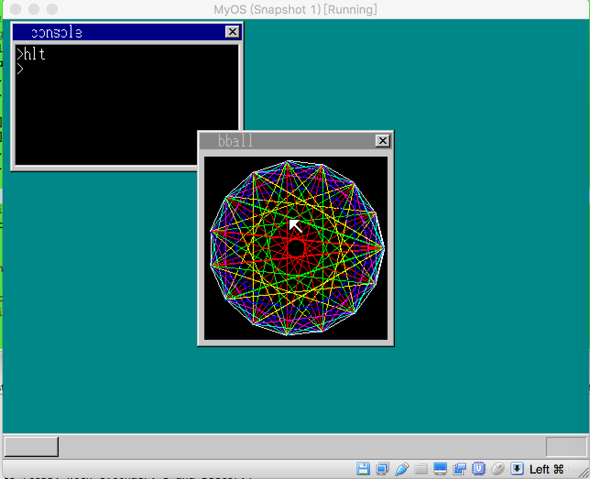

## 为系统开发星球大战游戏程序

当前，我们的系统已经发展到了一定较为完善的程度，当然最为一个练习系统，它不可能跟专业的windows或linux相比，但麻雀虽小五腑俱全，我们的系统还是能支持用户在其上面开发出不少复杂但又有趣的应用程序的，它所展现的功能完全可以称得上是一个鲁棒的操作系统。

我们看看第一个有趣的应用程序：不规则窗口。
很多独居特色的应用程序，一大特点之一就是不规则窗口，奇形怪状的窗体形态确实容易给人耳目一新的感觉，不规则窗口主要是把窗体的某部分用透明色来显现，现在我们就来尝试一下，在app.c中完成以下代码：

```
void main() {
    int win;
    char buf[150*70];
    win = api_openwin(buf, 150, 70, 255, "noterec");
    api_boxfilwin(win, 0, 50, 34, 69, 255);
    api_boxfilwin(win, 115, 50, 149, 69, 255);
    api_boxfilwin(win, 50, 30, 99, 49, 255);
    for (;;) {
        if (api_getkey(1) == 0x1c) {
            break;
        }
    }
    api_closewin(win);
    return;
}
```

上面代码先创建一个窗体，然后把窗体的若干个部分填充成透明色，于是窗体形态变成一个有趣的非矩形，上面代码完成后，运行起来情况如下：


接下来我们再看看一个更有意思的用户程序，线团火球！在app.c中添加代码如下

```
struct POINT {
    int x;
    int y;
};

void main() {
    int win;
    char buf[216*237];
    struct POINT table[18] = {
    {204,129},{195,90},{172,58},{137,38},{98,34},
    {61,46},{31,73},{15,110},{15,148},{31,185},
    {61,212},{98,224},{137,220},{172,200},{195,168},
    {204,129}
    };

    win = api_openwin(buf, 216, 237, -1, "bball");
    api_boxfilwin(win, 8, 29, 207, 228, 255);
    int i = 0, j = 0, dis = 0;
    for (i = 0; i <= 14; i++) {
      for(j = i+1; j <= 15; j++) {
          dis = j - i;
          if (dis >= 8) {
             dis = 15 - dis;
          }
          if (dis != 0) {
             api_linewin(win, table[i].x, table[i].y,
                         table[j].x, table[j].y, 8-dis);
          }
      }
    }

    api_refreshwin(win, 8, 29, 207, 228);
    for (;;) {
        if (api_getkey(1) == 0x1c) {
            break;
        }
    }
    api_closewin(win);

    return;    
}
```

上面代码运行后效果如下：




绘制出来的图案是不是非常惊艳，非常绚丽夺目，我们的系统平台还是蛮给力的。

接下来我们要放大招，开发一个有趣的星球大战游戏。星球大战是一款像素级游戏，它的形态让我想起早年，大概是98年，所谓电脑刚传入中国，系统还是DOS时，当时上电脑课最喜欢的莫过于有游戏可玩。代码比较长，我们分段实现，首先在app.c中输入以下代码：

```

#define win_width 240

void putstr(int win, char *winbuf,char * charset,
 int x, int y, int col, unsigned char *s) {
    int c, x0, i = 0, j;
    char *p, *q, t[2];
    x = x*8+8;
    y = y*16+29;
    x0 = x;
    while (s[i] != 0) {
        i++;
    }

    api_boxfilwin(win, 8, y, win_width - 8 , y+15, 0);

    q = winbuf + y * win_width; 
    t[1] = 0;
    for (;;) {
        c = *s;
        if (c == 0) {
            break;
        }

        if (c != ' ') {
            if ('a' <= c && c <= 'h') {
                p = charset + 16 * (c-'a');
                q += x;
                for (i = 0; i < 16; i++) {

                    if ((p[i] & 0x80) != 0) {q[0] = col;}
                    if ((p[i] & 0x40) != 0) {q[1] = col;}
                    if ((p[i] & 0x20) != 0) {q[2] = col;}
                    if ((p[i] & 0x10) != 0) {q[3] = col;}
                    if ((p[i] & 0x08) != 0) {q[4] = col;}
                    if ((p[i] & 0x04) != 0) {q[5] = col;}
                    if ((p[i] & 0x02) != 0) {q[6] = col;}
                    if ((p[i] & 0x01) != 0) {q[7] = col;}

                    q += win_width; 
                }
                q -= win_width * 16 + x;
            } else if((c>='i' && c <= 'z') || (c>='A' && c <= 'Z')){
                t[0] = *s;
                api_putstrwin(win, x, y, col,1,t);
            }
        }

        s++;
        x += 8;
    }

    api_refreshwin(win,  8, y, win_width - 8, y+15);
}


void main() {
    int win, i, j, ix, iy, fx;
    char winbuf[win_width * 237], invstr[32*6], s[12];
    char* p = winbuf;

    char invstr0[36] = {' ' , 'a','b','c','d',' ' ,'a','b','c','d', ' ',
                         'a','b','c','d',' ',  'a','b','c','d',' ',
                           'a','b','c','d', ' ',
                         0};

    char charset[18 * 8] = {
    0x00, 0x00, 0x00, 0x43, 0x5f, 0x5f, 0x5f, 0x7f,
    0x1f, 0x1f, 0x1f, 0x1f, 0x00, 0x20, 0x3f, 0x00,

    0x00, 0x0f, 0x7f, 0xff, 0xcf, 0xcf, 0xcf, 0xff,
    0xff, 0xe0, 0xff, 0xff, 0xc0, 0xc0, 0xc0, 0x00,

    0x00, 0xf0, 0xfe, 0xff, 0xf3, 0xf3, 0xf3, 0xff,
    0xff, 0x07, 0xff, 0xff, 0x03, 0x03, 0x03, 0x00,

    0x00, 0x00, 0x00, 0xc2, 0xfa, 0xfa, 0xfa, 0xfe,
    0xf8, 0xf8, 0xf8, 0xf8, 0x00, 0x04, 0xfc, 0x00,

    0x00, 0x00, 0x01, 0x01, 0x01, 0x01, 0x01, 0x01,
    0x01, 0x43, 0x47, 0x4f, 0x5f, 0x7f, 0x7f, 0x00,

    0x18, 0x7e, 0xff, 0xc3, 0xc3, 0xc3, 0xc3, 0xff,
    0xff, 0xff, 0xe7, 0xe7, 0xe7, 0xe7, 0xff, 0x00,

    0x00, 0x00, 0x80, 0x80, 0x80, 0x80, 0x80, 0x80,
    0x80, 0xc2, 0xe2, 0xf2, 0xfa, 0xfe, 0xfe, 0x00,

    0x00, 0x18, 0x18, 0x18, 0x18, 0x18, 0x18, 0x18,
    0x18, 0x18, 0x18, 0x18, 0x18, 0x18, 0x18, 0x00
    };

    win = api_openwin(winbuf, win_width, 237, -1, "invader");
    api_boxfilwin(win, 8, 29, win_width - 6, 228, 0);
    //putstr(win, winbuf, 22, 0, 7, "HIGH:00000000");

restart:
    fx = 18;
    char fly[8] = {'e', 'f', 'g', 0};
    putstr(win, winbuf, charset, 18, 11, 6, fly);

nextgroup:
    ix =  7;
    iy = 1;
    int invline = 6;
    for (i = 0; i < 3; i++) {
        for (j = 0; j < 20; j++) {
            invstr[i * 32 + j] = invstr0[j];
        }
        putstr(win, winbuf,charset, ix, iy + i, 2, invstr + i * 32);
    }


    api_refreshwin(win, 8, 29, 207, 228);

    for(;;) {
        if (api_getkey(1) == 0x1c) {
            break;
        }
    }

    api_closewin(win);

    return;
}
```

putstr函数有两个功能，当输入字符在’a’到’h’之间时，它根据点阵表charset，通过设置某个像素点的颜色来绘制图像。其中参数x,y是图像起始坐标，最后一个参数s用来控制图像绘制的方式，例如当最后的s内容为”abcd”时，该函数从charset表中取出前四行数据，其中每一个数值都在告诉代码在绘制哪一个像素点，它的绘制原理与早前我们讲解的如何绘制字符是一样的。我们先看看上面代码运行起来后的情况：


代码绘制了三排外星人和一架战斗机，在main函数中，代码:

```
restart:
    fx = 18;
    char fly[8] = {'e', 'f', 'g', 0};
    putstr(win, winbuf, charset, 18, 11, 6, fly);
```

绘制的就是图案底部的战斗机，而代码片段：

```
nextgroup:
    ix =  7;
    iy = 1;
    int invline = 6;
    for (i = 0; i < 3; i++) {
        for (j = 0; j < 20; j++) {
            invstr[i * 32 + j] = invstr0[j];
        }
        putstr(win, winbuf,charset, ix, iy + i, 2, invstr + i * 32);
    }
```

则是绘制了图案上方的三排外星人。

接着我们要想办法让图像动起来，这就需要使用到我们前面做过的定时器。首先，我们先添加代码，让飞机根据我们按键输入以便实现左右移动，因此我们添加日下代码：

```
void putstr(int win, char *winbuf,char * charset,
 int x, int y, int col, unsigned char *s) {
 ....
 }

 void waitting(int i, int timer, char* keyflag) {
    int j;
    if (i > 0) {
        api_settimer(timer, i);
        i = 128;
    } else {
        i = 0x1c;
    }

    for(;;) {
        j = api_getkey(1);
        if (i == j) {
            break;
        }

        if (j == 0x24) {
          //key j
            keyflag[0] = 1;
        }
        if (j == 0x25) {
            //key k
            keyflag[1] = 1;
        }
        if (j == 0x39) {
            //key space
            keyflag[2] = 1;
        }
    }

    return;
}

void main() {
    char keyflag[6];
    ....
    nextgroup:
    ....
    keyflag[0] = 0;
    keyflag[1] = 0;
    keyflag[2] = 0;

    for(;;) {
        waitting(4, timer, keyflag);
        if (keyflag[0] != 0 && fx > 1) {
           //fighter fly to left
           fx--;
           fly[0] = 'e', fly[1] = 'f', fly[2] = 'g', fly[3] = ' ';
           fly[4] = 0;
           putstr(win, winbuf, charset, fx, 11, 6, fly); 
           keyflag[0] = 0;
        }
        if (keyflag[1] != 0 && fx < 24) {
           fx++;
           fly[0] = ' ', fly[1] = 'e', fly[2] = 'f', fly[3] = 'g';
           fly[4] = 0;
           putstr(win, winbuf, charset, fx, 11, 6, fly);
           keyflag[1] = 0;
        }
    }
}
```

waitting 函数的作用是等待定时器放回结果，同时监控键盘按键，如果用户在键盘上点击按键’j’，那么它通过调用api_getkey就能获得对应扫描码，也就是0x24, 如果用户点击按键’k’，那么对应的扫描码为0x25，在main函数里，我们添加一个for循环，在里面我们调用waitting函数获取用户按键信息，当用户按下’j’后，我们把飞机向左移动一个单位，然后刷新窗口，如果用户点击的是k，那么我们把飞机向右移动一个单位，然后刷新窗口，上面代码完成后，编译加载到虚拟机，启动程序后，尝试按下按键’j’，我们可以发现飞机一直向左移动，知道抵达窗口左边界为止，效果如下：


飞机能移动后，我们需要外星人也飘动起来，因此我们添加如下代码：

```
void main () {
....
    for(;;) {
        waitting(4, timer, keyflag);
        ....
                //move aliens
        if (movewait != 0) {
            movewait--;
        } else {
            movewait = movewait0;
            if (ix + idir > 12 || ix + idir < 1) {
                if (iy + invline == 13) {
                   //game over
                   break;
                }
                idir = -idir;
                putstr(win, winbuf, charset,ix + 1, iy, 0, "  ");
                iy++;
            } else {
                ix += idir;
            }
            for (i = 0; i < invline; i++) {
                putstr(win, winbuf,charset, ix, iy + i, 2, invstr + i * 32);
            }
        } 
    }   
}
```

上面代码先把外星人向右移动，直到边缘时，iy++，这就使得外星人向下移动，与此同时idir = -idir; 使得外星人开始反向移动，一直到左边边缘，这种移动一直在进行，直到外星人的y坐标做够大时，游戏结束。


从上面我们可以看到，飞机挪到左边时，外星人移动到右边。接着我们要实现用户按下空格键时，飞机能发射炮弹，并且判断一旦炮弹击中外星人后，外星人会被消灭掉，这个功能的实现主要依赖下面代码：

```
for(;;) {
       if (laserwait != 0) {
            laserwait--;
            keyflag[2] = 0;
        }
        ....
       //draw laser bullet
        if (ly > 0) {
            if (ly < 8) {
                if (ix < lx && lx < ix + 25 && iy <= ly && ly < iy + invline) {
                    putstr(win, winbuf, charset, ix, ly, 2, invstr + (ly - iy) * 32);
                }//if (ix < lx ...)
                else {
                    putstr(win, winbuf, charset, lx, ly, 0, "  ");
               }
            }//if(ly < 13)
            ly--;
            if (ly > 0) {
                char c[2] = {'h', 0};
                putstr(win, winbuf,charset, lx, ly, 3, c);
            } // if(ly > 0)

            if (ix < lx && lx < ix + 25 && iy <= ly && ly < iy + invline) {
               p = invstr + (ly - iy) * 32 + (lx - ix);
               if (*p != ' ' ) {
                   //hit
                   for(p--; *p != ' '; p--) {}
                   for (i = 1; i < 5; i++) {
                       p[i] = ' ';
                   }
                  putstr(win, winbuf, charset, ix, ly, 2, invstr+(ly-iy)*32);
                  for(; invline > 0; invline--) {
                      for(p = invstr + (invline-1)*32; *p != 0; p++) {
                          if (*p != ' ') {
                              goto alive;
                          }
                      }
                  } 
            gameover:
                  //hit all 
                  movewait0 -= movewait0 / 3;
                  char gameover[12] = {'G','A','M','E',' ','O','V','E','R'};
                  putstr(win, winbuf, charset, 15, 6, 1, gameover);
                  waitting(10, timer, keyflag);

                  goto nextgroup;
            alive:
                  ly = 0;
               }
            } //if(ix < lx...)

        }//if (ly > 0)
    }
}
```

上面代码使得，当用户点击空格键时，程序就准备从飞机处发射出导弹。代码片段：


```
 if (ly > 0) {
                char c[2] = {'h', 0};
                putstr(win, winbuf,charset, lx, ly, 3, c);
            } // if(ly > 0)

```

它的作用是，如果用户点击了空格，同时外星人还没有入侵到飞机所在的势力范围，那么我们就绘制一个从底部向上发射的炮弹，接下来的系列代码是，当炮弹发射后，判断炮弹是否击中外星人，如果打到了，被击中的外星人要从屏幕上消失掉，这部分逻辑实现的情况如下：


从上图可以看到，黄色的竖线块就是飞机发射出的导弹，中间这排外星人被击毙了，所以在屏幕上没有显示出来。如果外星人下降到飞机所在高度，那么有游戏结束，如果外星人全部被击毙，那么战机成功保卫地球，游戏也结束：


游戏结束后，”GAME OVER”会打印到界面上，然后整个游戏重来一遍。

这个星球大战游戏是系统内核开发到此，我们做过的最为复杂的客户程序，它调用了几乎所有api,例如窗口绘制，字符串输出，时钟，键盘监听等等，这个复杂程序的成功运行，在一定程度上表明，我们的系统内核具备一定程度的复杂性和鲁棒性，虽然它不可与专业操作系统同日而语，但就算它再简单，再复杂，它也对得起一个“操作系统”的称号。

更详细的讲解和代码调试演示过程，请参看视频
Linux kernel Hacker, 从零构建自己的内核
————————————————
版权声明：本文为CSDN博主「tyler_download」的原创文章，遵循 CC 4.0 BY-SA 版权协议，转载请附上原文出处链接及本声明。
原文链接：https://blog.csdn.net/tyler_download/article/details/79046241